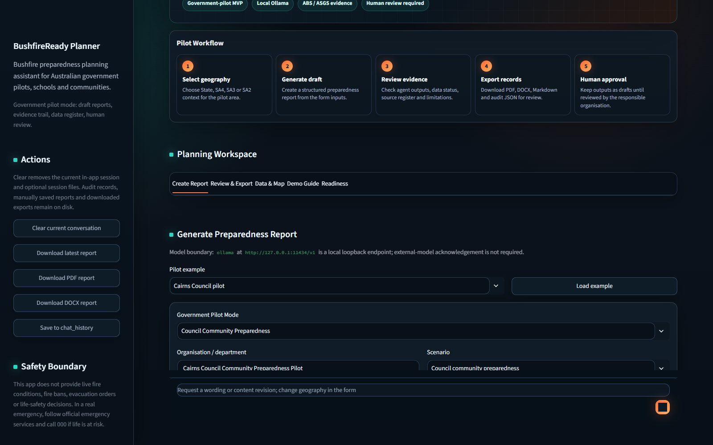
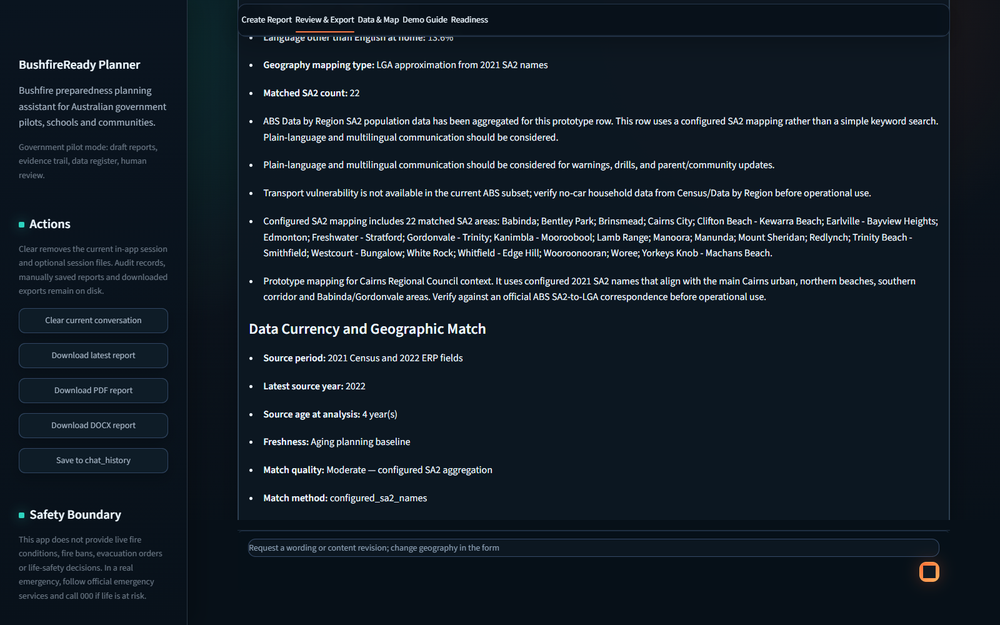
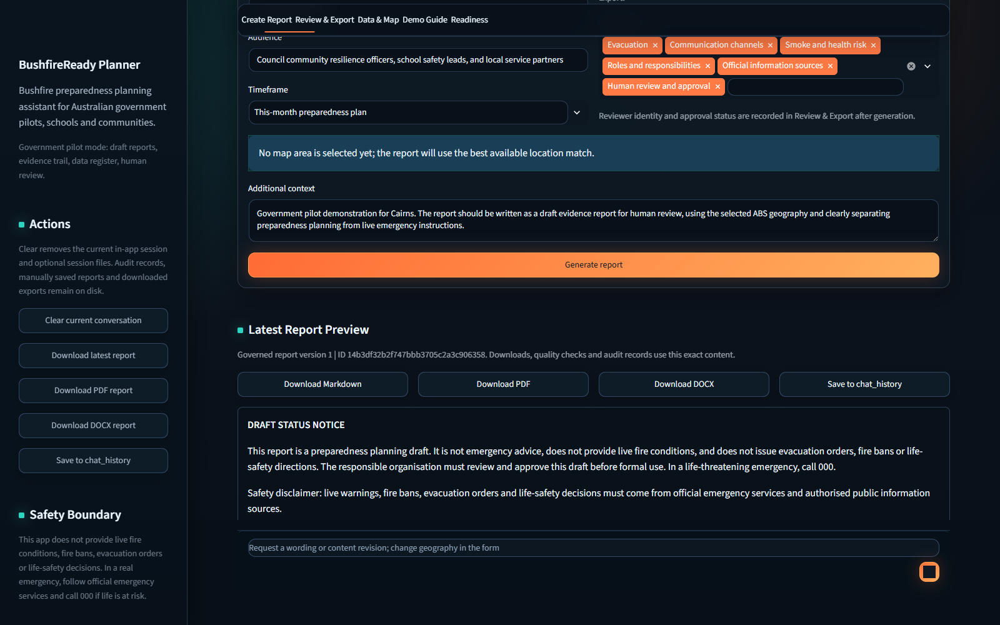
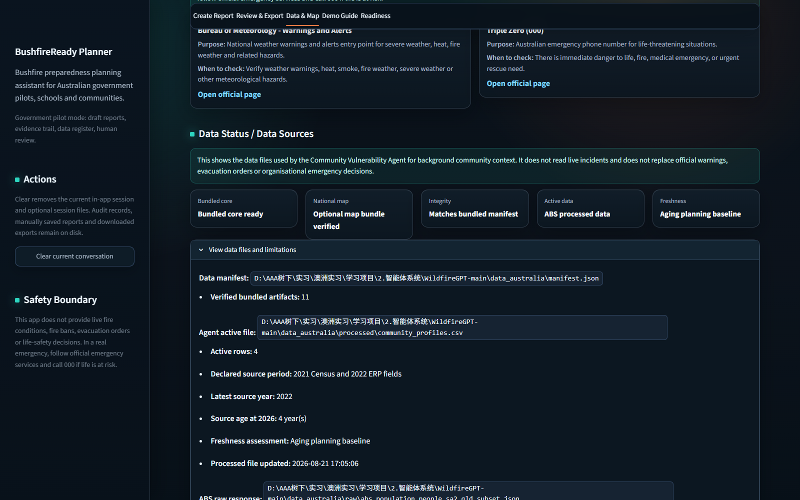

# BushfireReadyGPT: Local-First Multi-Agent AI for Australian Bushfire Preparedness

[](https://github.com/shuxiachai/BushfireReadyGPT/actions/workflows/tests.yml)
[](https://github.com/shuxiachai/BushfireReadyGPT/releases/latest)
[](https://www.python.org/)
[](https://streamlit.io/)
[](https://ollama.com/)
[](LICENSE)

> Turn Australian location and community context into auditable bushfire preparedness drafts through a local Ollama-powered multi-agent workflow.

**Local-first AI | Multi-agent evidence trail | ABS / ASGS context | Human-in-the-loop review | Markdown / PDF / DOCX exports**

BushfireReadyGPT is an Australia-focused bushfire preparedness planning MVP. It helps councils, schools and community resilience teams generate structured draft preparedness reports from a selected location, audience, scenario and planning focus.

The project runs locally through Ollama, exposes a deterministic multi-agent evidence trail, uses ABS / ASGS-derived Australian data context, and exports reviewable reports with human sign-off and audit records.

**中文简介：** 本项目是一个面向澳洲山火应急准备场景的多智能体报告生成系统原型。系统支持本地 Ollama 大模型推理、结构化表单输入、澳洲地区数据上下文、多 Agent 分析证据链、报告质量检查以及 Markdown / PDF / DOCX 导出。项目当前定位为 MVP / Prototype，适用于学习展示、作品集和受控试点讨论，不用于真实火情判断、撤离命令或生命安全决策。

This project was adapted from the Apache-2.0-licensed [project-araia/WildfireGPT](https://github.com/project-araia/WildfireGPT) / MARSHA project. Original United States wildfire data, experiments and inactive tools are treated as local legacy reference material only; the active application is now positioned around Australian bushfire preparedness. See [UPSTREAM.md](UPSTREAM.md) for provenance and modification notes.

## Current Status

**Stage:** Government-pilot MVP

**Current release:** `v0.3.0`

Ready for:

- Internship demonstration
- Coursework or portfolio showcase
- Controlled stakeholder discussion
- Early school, council or community pilot scoping

Not ready for:

- Operational emergency management
- Public life-safety decision support
- Government procurement
- Commercial deployment without legal, security, privacy and licence review

## What It Does

- Generates formal English bushfire preparedness draft reports.
- Supports council, school, community, household, care facility and land management scenarios.
- Uses a form-first workflow rather than a generic chatbot flow.
- Runs a local Australia-focused multi-agent analysis pipeline.
- Shows an Evidence Trail with profile, official source, community vulnerability, risk and planning outputs.
- Labels report provenance as O1 official reference, P2 processed data, R3 rule inference, A4 AI draft or U0 unverified input.
- Uses local ABS / ASGS-derived geography and community context.
- Provides official source, data and licence registers.
- Adds draft notices, evidence tables, safety disclaimers and human review sign-off.
- Treats follow-up edits as governed report revisions with a new report ID, version, quality result and audit record.
- Exports Markdown, PDF, DOCX and pilot export packages.
- Runs locally with Ollama, so no OpenAI API key is required.

## Technical Highlights

- Refactored the original chatbot-style interaction into a form-driven report generation workflow.
- Designed a deterministic multi-agent pipeline covering profile parsing, Australian data context, community vulnerability, risk context, planning and report quality checks.
- Replaced cloud-only OpenAI usage with local Ollama inference for offline-friendly demonstrations and no-cloud-key environments.
- Built a reviewable evidence trail, governance notice, human sign-off section and audit-ready pilot export package.
- Added deterministic evidence-confidence labels so official references, processed data, rule inference and AI prose are not presented as equivalent evidence.
- Added report versioning, approval validation and review-checklist reset so revised content cannot silently inherit an earlier approval.
- Isolated browser sessions in memory by default and replaced optional pickle persistence with explicitly enabled JSON persistence for single-user installations.
- Added Australia-specific official source, licence, data status and safety-boundary registries for more transparent outputs.
- Centralised every active data path, fail-closed bundled-core integrity validation and before/after analysis provenance checks.
- Added v4 append-only audit events that bind the exact report, deterministic sign-off, quality result, inputs, model boundary, frozen registers and recursive revision lineage.
- Made governed external-model calls stateless, tool-free and subject to an explicit per-session privacy acknowledgement.
- Added a local hybrid RAG pipeline with nine page-level licensed sources covering all eight Australian states and territories, deterministic abstention and hard-negative evaluation.
- Added a self-checking Windows launcher, an 8K-context Ollama model tuned for local GPU memory, and Windows CI coverage.
- Added report-level data currency, source-age and geographic-match warnings so approximate or aging evidence is visible in the report and Evidence Trail.
- Expanded real-model regression coverage to all six planning scenarios plus live-request refusal and no-RAG degradation cases.

## Product Tour

[Watch the 89-second local demo](docs/assets/bushfire-ready-gpt-demo.webm).

| Create a governed draft | Inspect evidence and data quality |
| --- | --- |
|  |  |

| Review the generated report | Verify map and data status |
| --- | --- |
|  |  |

## Example Output

For a current, reproducible demonstration generated with the local model and
verified RAG index, see:

- [governed Markdown report](examples/v0.3.0/cairns-council-report.md)
- [presentation-ready PDF](examples/v0.3.0/cairns-council-report.pdf)
- [editable DOCX](examples/v0.3.0/cairns-council-report.docx)
- [verified pilot export package](examples/v0.3.0/cairns-council-pilot-package.zip)
- [sample package notes](examples/v0.3.0/README.md)

The earlier [Cairns campus sample](examples/cairns_campus_bushfire_report.md)
remains as a lightweight historical example. All samples are demonstration
drafts, not live emergency plans or operational instructions.

## Safety Boundary

BushfireReadyGPT does **not** provide live fire conditions, fire bans, evacuation orders, official safe routes, confirmed safe assembly points or life-safety decisions.

It is a preparedness planning and draft reporting tool. In an emergency, follow official emergency services and call `000` if life is at risk.

## Quick Start

On Windows, install [Python 3.11-3.13](https://www.python.org/downloads/windows/)
and [Ollama](https://ollama.com/download/windows), then use the single launcher in
the project folder:

```text
Double-click Start BushfireReadyGPT.bat
```

Every launch checks the local environment before opening the app. Existing Python
dependencies, Ollama models and a valid RAG index are reused; only missing or
outdated components are installed or rebuilt. The launcher also creates the
dedicated 8K-context report model and starts Ollama when needed.

### Manual setup

These commands assume Windows PowerShell from the project root.

Create and activate a virtual environment:

```powershell
python -m venv .venv
.\.venv\Scripts\Activate.ps1
python -m pip install --upgrade pip
python -m pip install poetry==2.3.4
```

Install the locked runtime and development dependencies:

```powershell
poetry install --with dev --no-root
```

`pyproject.toml` and the committed `poetry.lock` are the reproducible source of
truth. `requirements.txt`, `requirements-dev.txt` and
`requirements-e2e.txt` remain runtime/development/browser-test compatibility
files for environments that cannot use Poetry; they are not lock files.

Install Ollama, then download the configured local model:

```powershell
ollama pull qwen2.5:7b
ollama pull embeddinggemma
ollama create bushfire-ready-qwen -f .\Modelfile
```

The first model writes the report; the second powers the optional local RAG
retriever. Build the RAG index from its declared official static sources:

```powershell
poetry run python scripts\build_rag_index.py --download
poetry run python scripts\evaluate_rag.py --top-k 5 --warmup --summary-only
```

The RAG corpus covers nine official pages across all eight states and territories. Retrieval combines
local dense embeddings with BM25 using reciprocal-rank fusion, applies a
deterministic source-diversity cap and exposes both component ranks in the
Evidence Trail. The committed 84-query benchmark includes 68 answerable cases
and 16 hard negatives. The documented local baseline achieves 0.9706 passage
Recall@5, 0.8922 MRR, 0.8235 Top-1 accuracy and 1.0000 unanswerable accuracy.

Raw RAG downloads, the verified document snapshot and Qdrant files stay local and are ignored by Git. The app
still works if the optional index is absent, stale or disabled with
`BUSHFIRE_RAG_ENABLED=false`; in that case no retrieved passage is sent to the
report model. See [docs/rag.md](docs/rag.md) for the data contract, integrity
checks, evaluation method and safety boundary.

The project launcher starts the local Ollama service automatically when needed. To run or troubleshoot Ollama manually, open a separate PowerShell terminal and run:

```powershell
ollama serve
```

Keep that Ollama terminal open when using the manual command. The automated launcher runs the service in the background instead.

Create `.env` in the project root:

```env
LLM_PROVIDER=ollama
OLLAMA_BASE_URL=http://127.0.0.1:11434/v1
OLLAMA_MODEL=bushfire-ready-qwen
```

Browser sessions are isolated in memory by default. For an explicitly single-user local installation, optional JSON session persistence can be enabled with `BUSHFIRE_SESSION_STATE_PATH=chat_history/session_state.json`. That plaintext file can contain complete reports, locations and reviewer sign-off identity; protect it with operating-system access controls and a retention policy. Do not use one shared state file for a multi-user deployment.

Endpoints on `localhost`, `127.0.0.0/8` or `::1` keep the default local-model workflow. Any other endpoint, including a remote Ollama server, is treated as external and fails closed unless the operator sets `BUSHFIRE_ALLOW_EXTERNAL_MODEL=true` and the user acknowledges the privacy disclosure for the current browser session. The disclosure lists the fields sent and warns that provider retention depends on the configured service and account; sensitive personal data and live incident or life-safety requests must not be entered.

For an external provider, generation sends the location, audience, scenario,
focus areas, timeframe, additional context, selected geography and deterministic
analysis context. Revision sends the requested change and current report body,
with the human sign-off removed. Governed calls are isolated and tool-free;
organisation and reviewer identity fields are not sent. The configured provider's
retention, training and deletion terms still apply.

Every generated report writes a privacy-minimised audit event to local disk. The
default event stores content hashes and bounded metadata, not the full report,
reviewer name or free-text notes. Setting
`BUSHFIRE_AUDIT_INCLUDE_SENSITIVE_CONTENT=true` opts into the complete payload and
requires an operator-approved access, retention and deletion policy. Clearing the
current conversation removes in-app/session state only; retained audit events,
manually saved reports and already downloaded packages remain.

Windows double-click startup:

```text
Double-click Start BushfireReadyGPT.bat
```

Alternative VSCode startup:

```text
Ctrl + Shift + P
Tasks: Run Task
Start BushfireReadyGPT
```

Or run from PowerShell:

```powershell
powershell -ExecutionPolicy Bypass -File .\start_app.ps1
```

The startup script reads the configured provider from `.env`. For local Ollama, it starts the service when needed, waits up to 30 seconds for the API, verifies that the configured model is installed, and only then launches Streamlit. It records the active project port locally, avoids launching a duplicate instance, and automatically selects an available port from `8501` to `8505`. Once the health check passes, the launcher opens the default browser; running the launcher again reopens the existing app. Streamlit is explicitly bound to `127.0.0.1` with usage telemetry disabled. Keep the terminal open while using the app. Press `Ctrl + C` or close this terminal to stop Streamlit and release the port.

## Demo Path

For the cleanest demonstration:

1. Open the app.
2. Go to `Create Report`.
3. Select `Cairns Council pilot`.
4. Click `Load example`.
5. Click `Generate report`.
6. Show `Latest Report Preview`.
7. Open `Review & Export` and show the Evidence Trail, Structural Report Check and Human Review Checklist.
8. Open `Data & Map` and show official sources, data status, licence register and map context.
9. Show the verified RAG index card and retrieved passage provenance in the Evidence Trail.
10. Download the pilot export package.
11. Explain the safety boundary and current commercial limitations.

See [docs/demo_walkthrough.md](docs/demo_walkthrough.md) for a full presentation script.

## Documentation

Start with:

- [docs/README.md](docs/README.md) - Documentation index and recommended reading order.
- [docs/resume_project_description.md](docs/resume_project_description.md) - Resume-ready Chinese/English bullets and interview talking points.
- [docs/showcase_package.md](docs/showcase_package.md) - Showcase package for presentations and portfolio review.
- [docs/project_overview.md](docs/project_overview.md) - Plain project explanation and positioning.
- [docs/demo_walkthrough.md](docs/demo_walkthrough.md) - Step-by-step live demo walkthrough.
- [docs/showcase_checklist.md](docs/showcase_checklist.md) - Pre-presentation readiness checklist.

Project and commercial context:

- [docs/architecture.md](docs/architecture.md) - Architecture, agent responsibilities and data flow.
- [docs/rag.md](docs/rag.md) - Local RAG design, build, evaluation and trust boundary.
- [docs/project_reassessment.md](docs/project_reassessment.md) - Current maturity, gaps and next build order.
- [docs/commercial_gap_assessment.md](docs/commercial_gap_assessment.md) - Commercial and government-readiness gap assessment.
- [docs/commercial_readiness_checklist.md](docs/commercial_readiness_checklist.md) - Commercial readiness checklist.
- [docs/pilot_pitch.md](docs/pilot_pitch.md) - One-page pilot pitch.
- [docs/pilot_feedback_form.md](docs/pilot_feedback_form.md) - Controlled pilot feedback form.
- [docs/pilot_protocol.md](docs/pilot_protocol.md) - Executable 3-5 participant pilot protocol.
- [docs/pilot_results.md](docs/pilot_results.md) - Honest pilot evidence register; external sessions are currently pending.
- [docs/benchmarks/report-generation-v0.3.0.json](docs/benchmarks/report-generation-v0.3.0.json) - Eight-case real-Ollama regression result.

Sample output and release evidence:

- [examples/v0.3.0/README.md](examples/v0.3.0/README.md) - current Markdown, PDF, DOCX and governed package.
- [docs/releases/v0.3.0.md](docs/releases/v0.3.0.md) - v0.3.0 scope, validation and limitations.

## Architecture Summary

```text
Streamlit UI
  -> Report form and workspace tabs
  -> Deterministic multi-agent pipeline
      -> Profile Agent
      -> Australian Data Agent
      -> Official Knowledge Agent (optional local RAG)
      -> Community Vulnerability Agent
      -> Risk Context Agent
      -> Planner Agent
      -> Report Agent
      -> Evidence confidence classification
      -> Report Quality Agent
  -> Local Ollama generation
  -> Evidence tables, sign-off and audit JSON
  -> Markdown / PDF / DOCX / pilot package export
```



```mermaid
flowchart LR
    A[User report form] --> B[Profile Agent]
    B --> C[Australian Data Agent]
    C --> D[Official Knowledge Agent]
    D --> E[Community Vulnerability Agent]
    E --> F[Risk Context Agent]
    F --> G[Planner Agent]
    G --> H[Ollama-backed Report Generation]
    H --> I[Report Quality Agent]
    I --> J[Evidence Trail and Human Review]
    J --> K[Markdown / PDF / DOCX / Pilot Package]
```

## Project Structure

```text
src/wildfireChat.py                 Streamlit application entry
src/app_state.py                    Shared Streamlit state helpers
src/session_store.py                Session persistence and conversation reset
src/report_workflow.py              Report generation, audit and human-review workflow
src/ui/                             Streamlit UI modules
src/app_catalog.py                  Official sources, form options and pilot examples
src/report_template.py              Fixed English report prompt and report structure
src/data_quality.py                 Source currency and geographic-match assessment
src/evidence_confidence.py          Shared O1 / P2 / R3 / A4 / U0 provenance rules
src/agents/                         Australia-focused multi-agent pipeline
src/rag/                            Local corpus, Ollama embeddings, Qdrant index and retrieval
src/model_runtime.py                Stateless, tool-free governed model client
src/coverage_map.py                 SA2 / SA3 / SA4 map and community profile loading
src/data_paths.py                   Central, environment-aware data path configuration
src/data_artifacts.py               Manifest validation, provenance and atomic publication
src/data_register.py                Data source register
src/licence_register.py             Licence register loader and export helpers
src/data_status.py                  Data status and source checks
src/audit.py                        Append-only, hash-linked local audit events
src/export_register.py              Frozen report-time data/licence register snapshots
src/export_package.py               Audit-bound pilot package creation and verification
src/pdf_export.py                   PDF report export
src/docx_export.py                  DOCX report export
src/export_content.py               Shared report metadata extraction for exports
data_australia/                     Australian metadata, rules and lightweight processed data
scripts/                            Data download / rebuild scripts
docs/                               Project, demo, governance and commercial-readiness docs
tests/                              Deterministic regression tests
start_app.ps1                       PowerShell implementation used by the launcher and VSCode task
```

## Data Notes

The active data layer is under `data_australia/`.

- `data_australia/raw/` stores raw official downloads or API responses for traceability and is ignored by Git.
- `data_australia/processed/` stores cleaned files used by the agents.
- `data_australia/manifest.json` verifies the bundled core files by size, row count and SHA-256 before analysis.
- `data_australia/rag/sources.yml` declares the optional static official RAG corpus; raw files and the built Qdrant index remain local.
- The pipeline refuses invalid bundled-core data and verifies that the files used did not change during analysis.
- Lightweight processed reference files may be committed for reproducible demos.
- Large raw and geospatial files, including the all-Australia map, are optional and intentionally ignored by Git.
- The nationwide selector is enabled only when its profile, boundary ID join and sidecar hashes all verify; structurally valid but unverified legacy files remain unavailable to reports and approval.
- Downloaders validate complete responses and publish related files, sidecar metadata and manifest updates as a recoverable transaction; every writer of the shared core manifest uses the same publication lock.
- Environment-variable data overrides remain available for draft analysis but are labelled `Unverified custom data` and cannot receive in-app organisational approval.
- Original-project legacy material is not part of the active Australian evidence layer.

The committed data is intended for demonstration, traceability and planning context only. It does not provide live incident status, fire danger ratings, evacuation orders, safe routes or confirmed assembly points.

The clean-clone core demo does not require the all-Australia map. To install or
rebuild that optional SA2 / SA3 / SA4 selection capability:

```powershell
poetry run python scripts\download_abs_sa2_all.py
```

To rebuild ASGS allocation and correspondence reference data:

```powershell
poetry run python scripts\download_abs_asgs_allocations.py
```

## Tests

Run the fast unit, integration, Streamlit smoke and AppTest workflow suite:

```powershell
poetry run pytest -m "not e2e" -q --cov=src --cov-report=term-missing --cov-fail-under=85
```

Run the same static, dependency and security checks as CI:

```powershell
poetry check --lock
poetry run python -m pip check
poetry run ruff check src tests scripts
poetry run bandit -q -r src scripts -x src/legacy
poetry run pip-audit --local --skip-editable
```

Install the browser-test dependencies and matching Chromium build once:

```powershell
poetry run python -m playwright install chromium
```

Run the real-browser workflow or the complete suite:

```powershell
poetry run pytest -m e2e -q
poetry run pytest -q
```

The RAG unit tests use a deterministic in-process embedder and temporary Qdrant
index, so CI does not need Ollama or network access. The separate local retrieval
evaluation uses the real `embeddinggemma` model and the downloaded nine-source
official corpus. It evaluates answerable and unanswerable queries separately and
reports Recall@K, MRR, Top-1 accuracy, false-positive rate and latency by
jurisdiction and category.

The `v0.3.0` real-model regression contains eight cases: all six supported
planning scenarios, a live-route safety-boundary case and a no-RAG degradation
case. The committed sample verifier also checks the package schema and hashes,
required report markers, PDF/DOCX readability and a dedicated DOCX human sign-off
page. These checks are engineering regression evidence, not stakeholder or
operational validation.

GitHub Actions runs the same suite automatically on Python 3.11 and 3.13 for
pushes to `main`, pull requests targeting `main`, and manual workflow runs. The
workflow also checks installed dependency consistency and does not require an
Ollama service because model-service failure paths are tested with controlled
mocks. The suite also renders the Streamlit app, starts a headless server, and
verifies both the health endpoint and the root web page. UI workflow tests cover
required-field validation, pilot-example loading, governed report generation and
versioned revision with a controlled model response. A separate Chromium job exercises pilot loading,
report generation through a local mock model endpoint, Markdown and ZIP downloads,
reviewer sign-off, audit updates, package-manifest verification, Cairns-to-Brisbane
map filtering, controlled official-source reachability and data-status rendering.

## Audit And Approval Boundary

New governed reports use the `government-pilot-v4` audit schema. Events are
append-only and hash-linked at the application layer. Each positive-integer report
version binds the exact Markdown body, deterministic Human Review Sign-off,
quality gate, inputs, selected geography, provider boundary, canonical review
record and the report-time data/licence register snapshot by SHA-256. Revisions
also bind and recursively package their verified ancestor lineage.

Stale, malformed, forked or snapshot-mismatched chains fail closed. Per-report
locks, authoritative head records, single-child revision claims and interrupted
write recovery prevent concurrent tabs or an incomplete local write from silently
forking the chain. Markdown, PDF, DOCX, audit JSON and `pilot-export-v3` packages
are offered only for the current verified report snapshot; every package artifact
is hashed in its manifest. Earlier audit schemas are legacy/read-only and must be
regenerated before governed export or review.

This is tamper-evident local application logging, not a formally immutable
government record. The prototype has no user authentication, independently
verified reviewer identity, digital signature, trusted timestamp, WORM storage or
external transparency log. An operator with filesystem access can delete or
replace the entire local history. Do not describe an in-app approval as legal,
procurement or agency approval without a separately governed identity and records
system.

## Deployment Boundary

The supplied launcher is a single-user local profile. It deliberately binds only
to loopback and does not provide authentication, TLS termination, rate limiting,
multi-user tenancy, a database, central logging, backups or a retention service.
A shared or internet-facing deployment requires those controls plus a privacy,
security, incident-response and data-licensing review.

## Git And Repository Hygiene

Before publishing or sharing the repository, review the current Git status and commit the intended changes:

```powershell
git status
git log --oneline -8
```

Ignored local files include `.env`, `.venv/`, `.claude/`, `.agents/`, runtime chat history and large raw/geospatial data.

## Next Improvement Areas

Without expanding the feature set, the next polishing work is:

- Run the prepared 3-5 person controlled pilot and publish only anonymised, measured results.
- Validate evidence labels and confidence boundaries with data, GIS and emergency-management reviewers.
- Review licence and disclaimer language with a legal/risk advisor before any commercial positioning.
- Add authenticated roles and externally anchored audit retention before any formal approval workflow.
