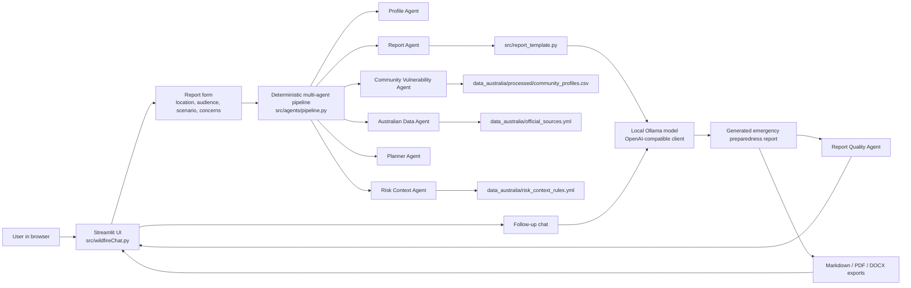
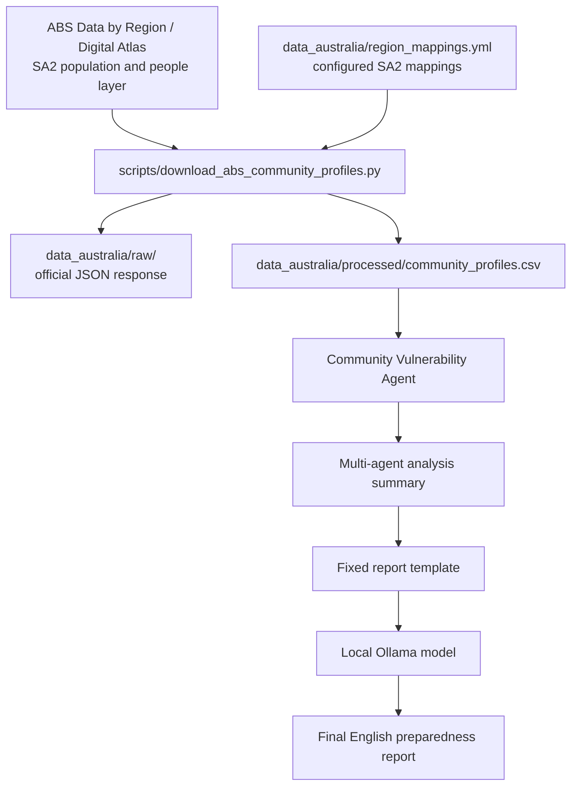

# BushfireReadyGPT Architecture

## System Architecture

## Data Flow

## Agent Responsibilities

| Agent | Responsibility | Output |
| --- | --- | --- |
| Profile Agent | Normalises user inputs and infers state/setting type | Location profile |
| Australian Data Agent | Selects official sources relevant to the location and scenario | Source list and limitations |
| Community Vulnerability Agent | Reads processed ABS community data and builds vulnerability notes | Population, age, language, SA2 mapping notes |
| Risk Context Agent | Matches local risk rules | Risk points and assumptions |
| Planner Agent | Converts risk and scenario into planning priorities | Action priorities |
| Report Agent | Formats deterministic findings for the LLM prompt | Multi-agent prompt context |
| Report Quality Agent | Checks generated report completeness and safety boundaries | Pass/warning/fail checklist |

## Current Boundary

The project is a planning and course-demonstration tool. It does not provide live fire conditions, evacuation orders, fire bans, or life-safety decisions. Live emergency instructions must come from official emergency services, and life-threatening emergencies require calling `000`.
