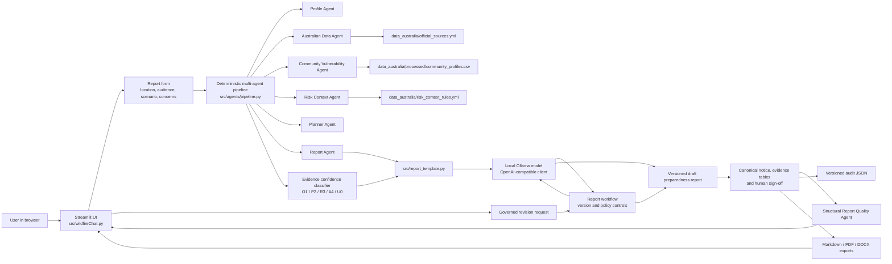
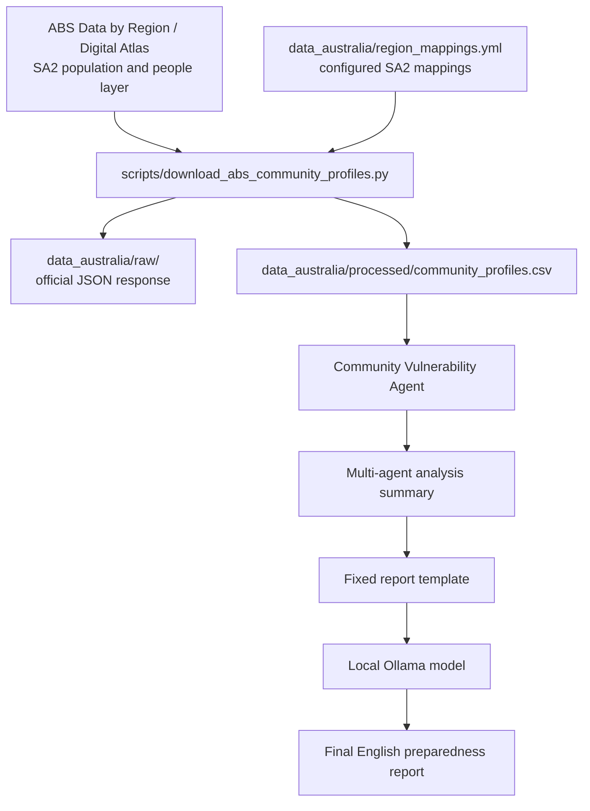

# BushfireReadyGPT Architecture

## System Architecture

```mermaid
flowchart LR
    User[User in browser] --> UI[Streamlit UI<br/>src/wildfireChat.py]
    UI --> Form[Report form<br/>location, audience, scenario, concerns]
    UI --> Revision[Governed revision request]

    Form --> Pipeline[Deterministic multi-agent pipeline<br/>src/agents/pipeline.py]
    Pipeline --> Profile[Profile Agent]
    Pipeline --> Data[Australian Data Agent]
    Pipeline --> Community[Community Vulnerability Agent]
    Pipeline --> Risk[Risk Context Agent]
    Pipeline --> Planner[Planner Agent]
    Pipeline --> ReportContext[Report Agent]

    Community --> ProcessedData[data_australia/processed/community_profiles.csv]
    Data --> OfficialSources[data_australia/official_sources.yml]
    Risk --> RiskRules[data_australia/risk_context_rules.yml]

    ReportContext --> Prompt[src/report_template.py]
    Pipeline --> Confidence[Evidence confidence classifier<br/>O1 / P2 / R3 / A4 / U0]
    Confidence --> Prompt
    Prompt --> Ollama[Local Ollama model<br/>OpenAI-compatible client]
    Revision --> Workflow[Report workflow<br/>version and policy controls]
    Workflow --> Ollama
    Ollama --> Workflow
    Workflow --> Report[Versioned draft preparedness report]
    Ollama --> Report

    Report --> Deterministic[Canonical notice, evidence tables<br/>and human sign-off]
    Deterministic --> Quality[Structural Report Quality Agent]
    Deterministic --> Audit[Versioned audit JSON]
    Deterministic --> Exports[Markdown / PDF / DOCX exports]
    Quality --> UI
    Exports --> UI
```

## Data Flow

```mermaid
flowchart TD
    ABS[ABS Data by Region / Digital Atlas<br/>SA2 population and people layer]
    Mapping[data_australia/region_mappings.yml<br/>configured SA2 mappings]
    Downloader[scripts/download_abs_community_profiles.py]
    Raw[data_australia/raw/<br/>official JSON response]
    Processed[data_australia/processed/community_profiles.csv]
    CommunityAgent[Community Vulnerability Agent]
    Analysis[Multi-agent analysis summary]
    Template[Fixed report template]
    LLM[Local Ollama model]
    FinalReport[Final English preparedness report]

    ABS --> Downloader
    Mapping --> Downloader
    Downloader --> Raw
    Downloader --> Processed
    Processed --> CommunityAgent
    CommunityAgent --> Analysis
    Analysis --> Template
    Template --> LLM
    LLM --> FinalReport
```

## Agent Responsibilities

| Agent | Responsibility | Output |
| --- | --- | --- |
| Profile Agent | Normalises user inputs and infers state/setting type | Location profile |
| Australian Data Agent | Selects official sources relevant to the location and scenario | Source list and limitations |
| Community Vulnerability Agent | Reads processed ABS community data and builds vulnerability notes | Population, age, language, SA2 mapping notes |
| Risk Context Agent | Matches local risk rules | Risk points and assumptions |
| Planner Agent | Converts risk and scenario into planning priorities | Action priorities |
| Report Agent | Formats deterministic findings for the LLM prompt | Multi-agent prompt context |
| Report Quality Agent | Checks generated report completeness and safety boundaries | Pass/warning/fail checklist |

The evidence confidence classifier is a deterministic shared component rather than an LLM agent. It records provenance in the analysis and audit JSON, supplies the prompt boundary, renders in the Evidence Trail and is appended to every exported report. Follow-up edits create a new governed report version; canonical evidence tables are rebuilt from stored analysis rather than trusted from model output, and the previous approval checklist is reset.

Browser sessions are isolated in memory by default. Optional JSON persistence is intended only for an explicitly single-user local installation. Audit records and manually saved reports remain local files; the prototype has no authenticated multi-user database.

## Current Boundary

The project is a planning and course-demonstration tool. Its Report Quality Agent is deterministic structural lint, not factual, legal or operational verification. It does not provide live fire conditions, evacuation orders, fire bans, or life-safety decisions. Live emergency instructions must come from official emergency services, and life-threatening emergencies require calling `000`.
