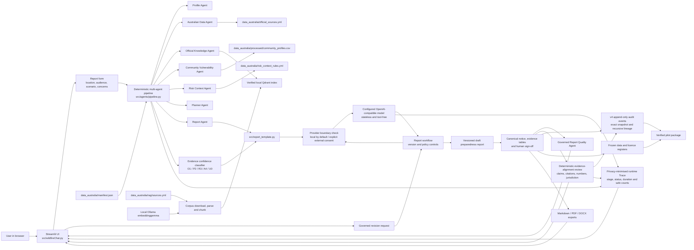
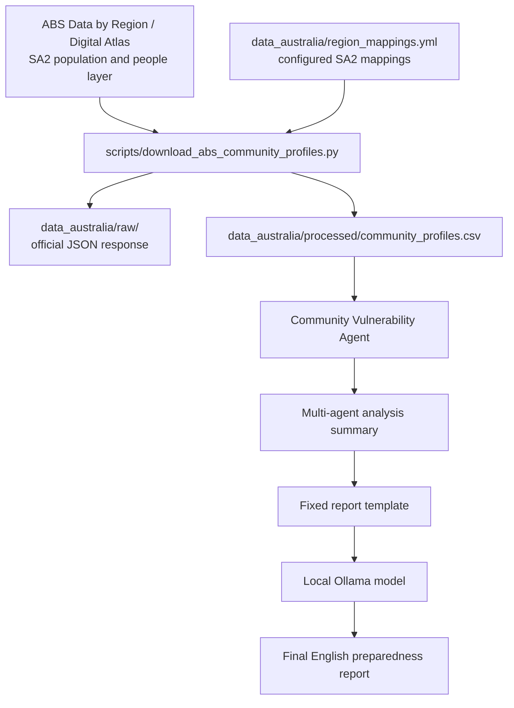

# BushfireReadyGPT Architecture

## System Architecture

```mermaid
flowchart LR
    User[User in browser] --> UI[Streamlit UI<br/>src/wildfireChat.py]
    UI --> Form[Report form<br/>location, audience, scenario, concerns]
    UI --> Revision[Governed revision request]

    Form --> Pipeline[Deterministic multi-agent pipeline<br/>src/agents/pipeline.py]
    Pipeline --> Profile[Profile Agent]
    Pipeline --> Data[Australian Data Agent]
    Pipeline --> Knowledge[Official Knowledge Agent]
    Pipeline --> Community[Community Vulnerability Agent]
    Pipeline --> Risk[Risk Context Agent]
    Pipeline --> Planner[Planner Agent]
    Pipeline --> ReportContext[Report Agent]

    Community --> ProcessedData[data_australia/processed/community_profiles.csv]
    Data --> OfficialSources[data_australia/official_sources.yml]
    Knowledge --> RagIndex[Verified local Qdrant index]
    RagCatalog[data_australia/rag/sources.yml] --> RagBuild[Corpus download, parse and chunk]
    OllamaEmbed[Local Ollama embeddinggemma] --> RagBuild
    RagBuild --> RagIndex
    Risk --> RiskRules[data_australia/risk_context_rules.yml]
    Manifest[data_australia/manifest.json] --> Pipeline

    ReportContext --> Prompt[src/report_template.py]
    Pipeline --> Confidence[Evidence confidence classifier<br/>O1 / P2 / R3 / A4 / U0]
    Confidence --> Prompt
    Prompt --> Privacy[Provider boundary check<br/>local by default / explicit external consent]
    Privacy --> Model[Configured OpenAI-compatible model<br/>stateless and tool-free]
    Revision --> Workflow[Report workflow<br/>version and policy controls]
    Workflow --> Privacy
    Model --> Workflow
    Workflow --> Report[Versioned draft preparedness report]

    Report --> Deterministic[Canonical notice, evidence tables<br/>and human sign-off]
    Deterministic --> Quality[Governed Report Quality Agent]
    Deterministic --> Grounding[Deterministic evidence-alignment review<br/>claims, citations, numbers, jurisdiction]
    Deterministic --> Audit[v4 append-only audit events<br/>exact snapshot and recursive lineage]
    Grounding --> Audit
    Pipeline --> Trace[Privacy-minimised runtime Trace<br/>stage, status, duration and safe counts]
    Model --> Trace
    Grounding --> Trace
    Deterministic --> Registers[Frozen data and licence registers]
    Deterministic --> Exports[Markdown / PDF / DOCX exports]
    Audit --> Package[Verified pilot package]
    Registers --> Package
    Quality --> UI
    Grounding --> UI
    Trace --> UI
    Exports --> UI
```

## Data Flow

```mermaid
flowchart TD
    ABS[ABS Data by Region / Digital Atlas<br/>SA2 population and people layer]
    Mapping[data_australia/region_mappings.yml<br/>configured SA2 mappings]
    Downloader[scripts/download_abs_community_profiles.py]
    Raw[data_australia/raw/<br/>official JSON response]
    Processed[data_australia/processed/community_profiles.csv]
    CommunityAgent[Community Vulnerability Agent]
    Analysis[Multi-agent analysis summary]
    Template[Fixed report template]
    LLM[Local Ollama model]
    FinalReport[Final English preparedness report]

    ABS --> Downloader
    Mapping --> Downloader
    Downloader --> Raw
    Downloader --> Processed
    Processed --> CommunityAgent
    CommunityAgent --> Analysis
    Analysis --> Template
    Template --> LLM
    LLM --> FinalReport
```

## Agent Responsibilities

| Agent | Responsibility | Output |
| --- | --- | --- |
| Profile Agent | Normalises user inputs and infers state/setting type | Location profile |
| Australian Data Agent | Selects official sources relevant to the location and scenario | Source list and limitations |
| Official Knowledge Agent | Queries the optional verified local RAG index with jurisdiction filtering | Attributed passages, scores, hashes and limitations |
| Community Vulnerability Agent | Reads processed ABS community data and builds vulnerability notes | Population, age, language, SA2 mapping notes |
| Risk Context Agent | Matches local risk rules | Risk points and assumptions |
| Planner Agent | Converts risk and scenario into planning priorities | Action priorities |
| Report Agent | Formats deterministic findings for the LLM prompt | Multi-agent prompt context |
| Report Quality Agent | Checks generated report completeness and safety boundaries | Pass/warning/fail checklist |

The Report Quality Agent delegates prohibited operational-assertion detection
to the deterministic `SafetyBoundaryEvaluator` in `src/safety_boundary.py`.

The eight named agents are specialised, deterministic pipeline components; none
is an independent language-model call. One governed model call writes the report
narrative; the canonical governed gate may request up to two stateless
replacement attempts. The same gate is recomputed for generation, revision,
organisational approval and governed pilot-package export, with 13 fixed structure/safety
checks plus conditional RAG source attribution. This keeps orchestration
reproducible, reduces latency and makes the evidence trail inspectable while
still demonstrating clear agent boundaries.

The evidence confidence classifier is a deterministic shared component rather than an LLM agent. It records provenance in the analysis and audit JSON, supplies the prompt boundary, renders in the Evidence Trail and is appended to every exported report. Follow-up edits create a new governed report version; canonical evidence tables are rebuilt from stored analysis rather than trusted from model output, and the previous approval checklist is reset.

The evidence-alignment evaluator is also deterministic and separate from the
Report Quality Agent. Governed quality checks whether required report controls
exist and reject high-confidence safety-boundary assertions; evidence alignment
extracts attributable narrative claims and compares them with the frozen
analysis and retrieved passages. It reports citation, numeric and jurisdiction
issues for human review but does not claim semantic fact verification and does
not independently authorise a report.

The RAG path is optional and fail-closed. Its source catalog restricts downloads to declared HTTPS URLs and local paths, requires page-level licence and verification metadata, and covers all eight states and territories. HTML extraction can target one or more declared ID elements, and PDF/HTML signatures are checked before atomic publication. Builds use deterministic chunk IDs, local Ollama embeddings, a canonical document snapshot and a staged Qdrant directory. The manifest binds the catalog, exact source bytes, document snapshot, chunk corpus, model and dimensions. Build, inspection and retrieval operations for the same resolved index acquire one fixed process-then-file lock order, coordinating embedded Qdrant both within the app and with a separate local build process. A build captures an immutable private catalog/source snapshot, verifies it before publication and rolls back to the previous index if live inputs drift in the publication window. Retrieval validates the index at entry and exit, filters by jurisdiction, then combines dense candidates with BM25 through weighted reciprocal-rank fusion, bounded metadata boosts and a per-source diversity cap. It also validates the Qdrant point count and every returned point ID/text hash before adding passages to the prompt. Component scores, ranks and rerank reasons are exposed for review; retrieved text is delimited as untrusted evidence, never as instructions, and is excluded from privacy-minimised audit events. Live/life-safety queries and unsupported free-text queries deterministically abstain. A missing, stale or corrupt index results in zero RAG passages while the deterministic pipeline continues.

Cross-process locks store a PID plus an unpredictable owner token. Unlocking
requires the same token, so a delayed owner cannot remove its successor's lock.
An invalid or partially initialised record is retained during the normal
initialisation window and becomes recoverable only after the configured stale
threshold; a valid record is reclaimed only when its PID is confirmed dead.
This conservative rule is shared by audit and RAG paths.

Retrieved metadata is normalised before prompt assembly. Model-authored claims
must cite the canonical `[O1-RAG][source_id=...] <title>` label and are forbidden
from writing, inferring or retyping URLs. The application appends verified URLs
from frozen deterministic metadata in Evidence Table 4 and Evidence Table 5, so
model prose is never the link authority.

`DataPaths` is the single source of active data locations for the map, status views and every pipeline agent. Explicit map selection is resolved into one effective geography before downstream analysis; an unknown form-level state inherits the selected state, while a known cross-state conflict fails closed. The bundled core is checked against `data_australia/manifest.json` before use, nested YAML artifacts are schema-validated with field-level errors, and provenance digests are compared again after analysis so a concurrent refresh cannot silently relabel an analysis. Validated downloader outputs are staged and published as recoverable multi-file transactions; writers of the shared core manifest use one publication lock and recovery journal. The optional nationwide map additionally requires matching profile/boundary structure and a hash-valid bundle sidecar before selection, report generation or organisational approval.

Browser sessions are isolated in memory by default. Optional JSON persistence is intended only for an explicitly single-user local installation and can contain full report/sign-off data. Persisted state has a versioned, size-bounded and recursively validated schema; malformed or oversized state does not hydrate, and a failed clear cannot silently restore stale state in the running process. Report/revision fields also have backend character and byte budgets, and reviewed/approved records require a valid non-future review date. Governed model completions are stateless and tool-free, enforce one total streaming deadline and reject empty usable output; generation, revision and release evaluation share the same bounded replacement-repair implementation. External endpoints require an explicit privacy acknowledgement. Audit records are privacy-minimised, append-only and hash-linked at the application layer; new v4 events bind the `governed-report-v3` quality policy and fingerprint, exact report, deterministic sign-off, quality, inputs, provider boundary, frozen register snapshot and recursive revision ancestry, while historical v2 bindings remain readable. Ancestry verification is iterative so valid long histories do not depend on Python recursion depth. `pilot-export-v4` requires the current policy, a passing fresh gate and the complete analysis whose hash matches the audit. Legacy events remain readable. A `quality.reassessed` transition may update only the policy result while preserving the exact report, sign-off, status and package context; it explicitly records that no human review occurred and cannot be used as the export head until a later `review.recorded` event is appended. Clearing a session does not delete retained audit or saved-report files. The prototype has no authenticated multi-user database, digital signature, trusted timestamp or WORM store, so this local chain is tamper-evident rather than formally immutable.

The Windows launcher remains an orchestration boundary rather than a second
application runtime. A fake-Ollama integration test exercises environment
precedence, service/model probes and the complete launch path without requiring
a live model download. Static, format, dependency and security checks share one
PowerShell entry point; repository-local `/tmp/` output is ignored.

The `v0.5.0` release evidence is a separate reproducibility layer. RAG and report evaluation artifacts retain all rows and bind exact input-file SHA-256 values, source commit `e02f07687ee2e2329fc59afb5fe1c8ea4f532646`, a shared RAG-index identity and the relevant embedding/generation model digests; the report artifact also binds the exact `governed-report-v2` fingerprint `7c20b6fa049dc1028cc367955eb28b5434318b2d4050995cc9cf58b53a5da9d1`. Active release evaluations now verify stable dataset, Git, index and model provenance before and after every question or scenario call and bind the index identity actually used by retrieval, so A-to-B-to-A drift visible across call boundaries cannot be hidden by equal start/end snapshots. They abort before artifact publication on any mismatch. A model-tag swap that begins and ends wholly inside one HTTP call remains unobservable and is explicitly disclosed in new run metadata. The offline release verifier then cross-checks project version, source datasets, active gates, shared provenance and the sample package's policy, provider, model, local-loopback boundary and RAG manifest. The published `v0.5.0` files remain immutable historical evidence; these stronger checks apply to future release runs.

Operational Trace is deliberately separate from the audit chain. One atomic local
record captures allowlisted stage names, status, duration, bounded counts/rates
and safe error codes for each report generation or revision. Per-agent stages,
model attempts, repair use, evidence-alignment metrics, audit write and optional
session persistence are observable without storing prompts, reports, retrieved
passages, locations, audiences, reviewer identity or free text. The Readiness tab
shows local aggregates; this is not a remote tracing backend or multi-instance
monitoring system.

## Current Boundary

The project is a planning and course-demonstration tool. Its Report Quality Agent
is deterministic governed structure/evidence-control/safety-boundary lint and
its evidence-alignment evaluator is a bounded lexical heuristic; neither
establishes factual truth, legal fitness or operational accuracy. It does not
provide live fire conditions, evacuation orders, fire bans, or life-safety
decisions. Live emergency instructions must come from official emergency
services, and life-threatening emergencies require calling `000`.
