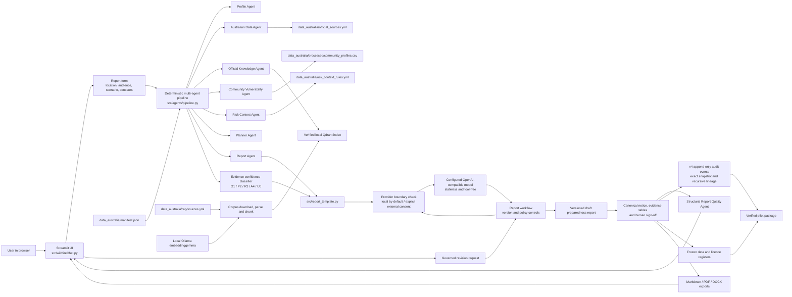
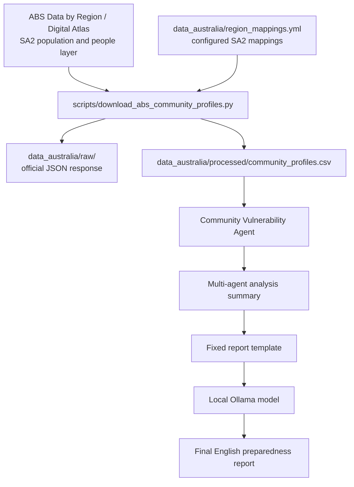

# BushfireReadyGPT Architecture

## System Architecture

```mermaid
flowchart LR
    User[User in browser] --> UI[Streamlit UI<br/>src/wildfireChat.py]
    UI --> Form[Report form<br/>location, audience, scenario, concerns]
    UI --> Revision[Governed revision request]

    Form --> Pipeline[Deterministic multi-agent pipeline<br/>src/agents/pipeline.py]
    Pipeline --> Profile[Profile Agent]
    Pipeline --> Data[Australian Data Agent]
    Pipeline --> Knowledge[Official Knowledge Agent]
    Pipeline --> Community[Community Vulnerability Agent]
    Pipeline --> Risk[Risk Context Agent]
    Pipeline --> Planner[Planner Agent]
    Pipeline --> ReportContext[Report Agent]

    Community --> ProcessedData[data_australia/processed/community_profiles.csv]
    Data --> OfficialSources[data_australia/official_sources.yml]
    Knowledge --> RagIndex[Verified local Qdrant index]
    RagCatalog[data_australia/rag/sources.yml] --> RagBuild[Corpus download, parse and chunk]
    OllamaEmbed[Local Ollama embeddinggemma] --> RagBuild
    RagBuild --> RagIndex
    Risk --> RiskRules[data_australia/risk_context_rules.yml]
    Manifest[data_australia/manifest.json] --> Pipeline

    ReportContext --> Prompt[src/report_template.py]
    Pipeline --> Confidence[Evidence confidence classifier<br/>O1 / P2 / R3 / A4 / U0]
    Confidence --> Prompt
    Prompt --> Privacy[Provider boundary check<br/>local by default / explicit external consent]
    Privacy --> Model[Configured OpenAI-compatible model<br/>stateless and tool-free]
    Revision --> Workflow[Report workflow<br/>version and policy controls]
    Workflow --> Privacy
    Model --> Workflow
    Workflow --> Report[Versioned draft preparedness report]

    Report --> Deterministic[Canonical notice, evidence tables<br/>and human sign-off]
    Deterministic --> Quality[Structural Report Quality Agent]
    Deterministic --> Audit[v4 append-only audit events<br/>exact snapshot and recursive lineage]
    Deterministic --> Registers[Frozen data and licence registers]
    Deterministic --> Exports[Markdown / PDF / DOCX exports]
    Audit --> Package[Verified pilot package]
    Registers --> Package
    Quality --> UI
    Exports --> UI
```

## Data Flow

```mermaid
flowchart TD
    ABS[ABS Data by Region / Digital Atlas<br/>SA2 population and people layer]
    Mapping[data_australia/region_mappings.yml<br/>configured SA2 mappings]
    Downloader[scripts/download_abs_community_profiles.py]
    Raw[data_australia/raw/<br/>official JSON response]
    Processed[data_australia/processed/community_profiles.csv]
    CommunityAgent[Community Vulnerability Agent]
    Analysis[Multi-agent analysis summary]
    Template[Fixed report template]
    LLM[Local Ollama model]
    FinalReport[Final English preparedness report]

    ABS --> Downloader
    Mapping --> Downloader
    Downloader --> Raw
    Downloader --> Processed
    Processed --> CommunityAgent
    CommunityAgent --> Analysis
    Analysis --> Template
    Template --> LLM
    LLM --> FinalReport
```

## Agent Responsibilities

| Agent | Responsibility | Output |
| --- | --- | --- |
| Profile Agent | Normalises user inputs and infers state/setting type | Location profile |
| Australian Data Agent | Selects official sources relevant to the location and scenario | Source list and limitations |
| Official Knowledge Agent | Queries the optional verified local RAG index with jurisdiction filtering | Attributed passages, scores, hashes and limitations |
| Community Vulnerability Agent | Reads processed ABS community data and builds vulnerability notes | Population, age, language, SA2 mapping notes |
| Risk Context Agent | Matches local risk rules | Risk points and assumptions |
| Planner Agent | Converts risk and scenario into planning priorities | Action priorities |
| Report Agent | Formats deterministic findings for the LLM prompt | Multi-agent prompt context |
| Report Quality Agent | Checks generated report completeness and safety boundaries | Pass/warning/fail checklist |

The named agents are specialised, deterministic pipeline components, not seven
independent language-model calls. One governed model call writes the report
narrative; a second call is made only when the structural gate requests one
repair. This keeps orchestration reproducible, reduces latency and makes the
evidence trail inspectable while still demonstrating clear agent boundaries.

The evidence confidence classifier is a deterministic shared component rather than an LLM agent. It records provenance in the analysis and audit JSON, supplies the prompt boundary, renders in the Evidence Trail and is appended to every exported report. Follow-up edits create a new governed report version; canonical evidence tables are rebuilt from stored analysis rather than trusted from model output, and the previous approval checklist is reset.

The RAG path is optional and fail-closed. Its source catalog restricts downloads to declared HTTPS URLs and local paths, requires page-level licence and verification metadata, and covers all eight states and territories. HTML extraction can target one or more declared ID elements, and PDF/HTML signatures are checked before atomic publication. Builds use deterministic chunk IDs, local Ollama embeddings, a canonical document snapshot and a staged Qdrant directory. The manifest binds the catalog, exact source bytes, document snapshot, chunk corpus, model and dimensions. Retrieval validates those bindings and filters by jurisdiction before combining dense candidates with BM25 through weighted reciprocal-rank fusion, bounded metadata boosts and a per-source diversity cap. It also validates the Qdrant point count and every returned point ID/text hash before adding passages to the prompt. Component scores, ranks and rerank reasons are exposed for review; retrieved text is delimited as untrusted evidence, never as instructions, and is excluded from privacy-minimised audit events. Live/life-safety queries and unsupported free-text queries deterministically abstain. A missing, stale or corrupt index results in zero RAG passages while the deterministic pipeline continues.

`DataPaths` is the single source of active data locations for the map, status views and every pipeline agent. The bundled core is checked against `data_australia/manifest.json` before use, and provenance digests are compared again after analysis so a concurrent refresh cannot silently relabel an analysis. Validated downloader outputs are staged and published as recoverable multi-file transactions; writers of the shared core manifest use one publication lock and recovery journal. The optional nationwide map additionally requires matching profile/boundary structure and a hash-valid bundle sidecar before selection, report generation or organisational approval.

Browser sessions are isolated in memory by default. Optional JSON persistence is intended only for an explicitly single-user local installation and can contain full report/sign-off data. Governed model completions are stateless and tool-free, and external endpoints require an explicit privacy acknowledgement. Audit records are privacy-minimised, append-only and hash-linked at the application layer; v4 events bind the exact report, deterministic sign-off, quality, inputs, provider boundary, frozen register snapshot and recursive revision ancestry. Export surfaces verify the current authoritative head and exact snapshot before returning files. Clearing a session does not delete retained audit or saved-report files. The prototype has no authenticated multi-user database, digital signature, trusted timestamp or WORM store, so this local chain is tamper-evident rather than formally immutable.

## Current Boundary

The project is a planning and course-demonstration tool. Its Report Quality Agent is deterministic structural lint, not factual, legal or operational verification. It does not provide live fire conditions, evacuation orders, fire bans, or life-safety decisions. Live emergency instructions must come from official emergency services, and life-threatening emergencies require calling `000`.
