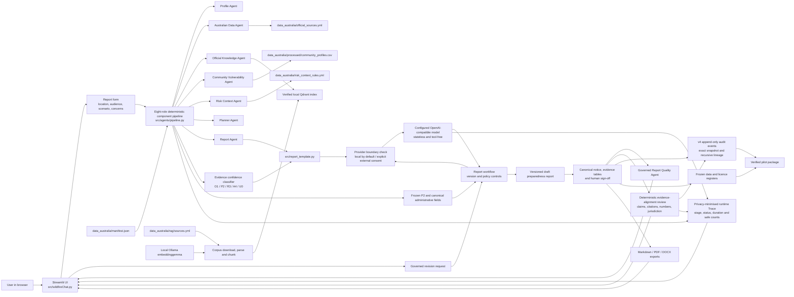
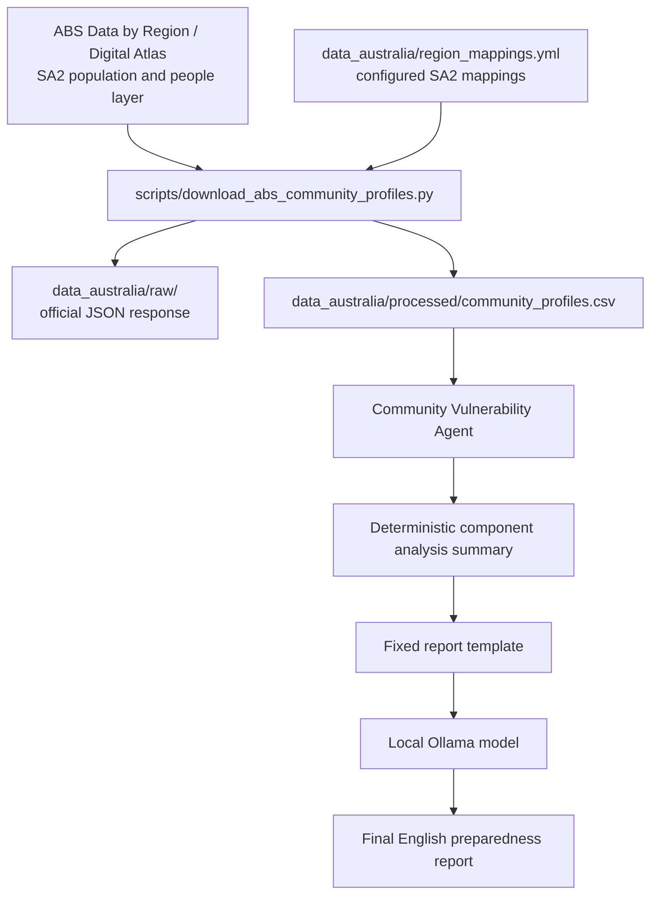

# BushfireReadyGPT Architecture

## Current file map

Paths below are relative to the repository root. “Current application” identifies
the maintained execution path, not production readiness. The tests are navigation
references, not a new validation result; this is a responsibility map, not an
exhaustive list of every module.

| Layer / files | Responsibility and caller relationship | Representative tests |
| --- | --- | --- |
| [Windows launcher](../Start%20BushfireReadyGPT.bat) → [start_app.ps1](../start_app.ps1) | Environment/service/model preflight, then launches Streamlit at `src/wildfireChat.py`. | [Launcher](../tests/test_windows_launcher.py), [CPU preflight](../tests/test_windows_cpu_preflight.py) |
| [Dockerfile](../Dockerfile) → [start_container.py](../scripts/start_container.py) → [container_runtime.py](../src/container_runtime.py) | Container configuration, volume and corpus preparation, then the same Streamlit application. | [Runtime](../tests/test_container_runtime.py), [Private corpus](../tests/test_container_private_corpus.py) |
| [wildfireChat.py](../src/wildfireChat.py), [report_views.py](../src/ui/report_views.py), [review_views.py](../src/ui/review_views.py) | Compose workspace, form, preview and review/export controls; delegate generation and revision to the workflow. | [UI workflow](../tests/test_streamlit_workflow.py), [Body-claim review](../tests/test_body_claim_review_ui.py) |
| [report_workflow.py](../src/report_workflow.py) | Validate input/provider permission; orchestrate analysis, prompt and bounded generation; finalise versions, evidence, review state and audit binding. | [Core pipeline](../tests/test_core_pipeline.py), [Revision boundaries](../tests/test_governed_revision_boundaries.py) |
| [pipeline.py](../src/agents/pipeline.py), [report_agent.py](../src/agents/report_agent.py) | Run deterministic profile/data/community/knowledge/risk/planner stages; assemble planning context for the prompt. The Report Agent does not call a model. | [Core pipeline](../tests/test_core_pipeline.py), [Planning context](../tests/test_planning_context_v2.py) |
| [data_paths.py](../src/data_paths.py), [data_artifacts.py](../src/data_artifacts.py), [RAG service](../src/rag/service.py), [RAG context](../src/rag/context.py) | Resolve/verify data, retrieve verified passages and assemble bounded context for the pipeline. RAG is optional locally; cloud generation requires available verified infrastructure. | [Data integrity](../tests/test_data_artifacts.py), [Retrieval](../tests/test_rag_pipeline.py), [Cloud availability](../tests/test_cloud_report_availability.py) |
| [report_template.py](../src/report_template.py), [source_attribution.py](../src/source_attribution.py) | Build prompts from supplied analysis; provide opaque citation tokens, deterministic attribution expansion, notices, evidence tables and sign-off. Prompt construction does not rerun analysis. | [Prompt contract](../tests/test_report_prompt_contract.py), [Repair flow](../tests/test_report_repair_flow.py) |
| [report_owned_fields.py](../src/report_owned_fields.py) | Define frozen P2 facts and explicitly unconfirmed role/action/review fields; retain the historical slot helper and check exact saved blocks without repair. | [Owned fields](../tests/test_report_owned_fields.py), [Bundled pipeline](../tests/test_owned_fields_pipeline.py) |
| [report_section_protocol.py](../src/report_section_protocol.py) | Admit a strict 15-section prose object, render the current report skeleton and invert exact saved bodies without repair. | [Section protocol](../tests/test_report_section_protocol.py) |
| [current_model_evidence.py](../src/current_model_evidence.py), [section_protocol_error.py](../src/section_protocol_error.py) | Add explicit current output-mode metadata and content-free protocol errors without modifying byte-pinned historical evidence/response helpers. | [Section protocol](../tests/test_report_section_protocol.py), [Runtime evidence](../tests/test_model_evidence.py) |
| [model_runtime.py](../src/model_runtime.py), [model_evidence.py](../src/model_evidence.py) | Execute bounded stateless requests and bind submitted evidence context to responses, through the workflow's model callback. | [Model runtime](../tests/test_model_runtime.py), [Evidence capture](../tests/test_model_evidence.py) |
| [report_generation_quality.py](../src/report_generation_quality.py), [report_quality_agent.py](../src/agents/report_quality_agent.py), [safety_boundary.py](../src/safety_boundary.py) | Share the deterministic governed gate and bounded replacement-repair policy across lifecycle stages. | [Repair flow](../tests/test_report_repair_flow.py), [Safety](../tests/test_safety_boundary.py), [Policy binding](../tests/test_quality_policy_audit.py) |
| [report_grounding.py](../src/report_grounding.py), [report_claim_evidence.py](../src/report_claim_evidence.py), [source_applicability.py](../src/source_applicability.py) | Provide evidence/body-claim diagnostics and a limited review-time source-applicability advisory; none establishes semantic truth or local applicability. | [Grounding](../tests/test_report_grounding.py), [Body claims](../tests/test_report_claim_evidence.py), [Review disposition](../tests/test_review_evidence_disposition.py) |
| [audit.py](../src/audit.py), [export_register.py](../src/export_register.py), [export_package.py](../src/export_package.py), [PDF](../src/pdf_export.py), [DOCX](../src/docx_export.py), [downloads.py](../src/ui/downloads.py) | Bind versions/review events and frozen registers; verify package eligibility, render formats and deliver exports through the UI. | [Audit](../tests/test_audit_governance.py), [Core pipeline](../tests/test_core_pipeline.py), [Private downloads](../tests/test_private_downloads.py) |
| [session_store.py](../src/session_store.py), [revision_state.py](../src/revision_state.py), [runtime_trace.py](../src/runtime_trace.py) | Manage session state, recoverable revision requests and privacy-minimised stage observations around the workflow. | [Session validation](../tests/test_session_store_hardening.py), [Revision recovery](../tests/test_revision_recovery.py), [Trace](../tests/test_runtime_trace.py) |

Generation follows UI → workflow preconditions → deterministic analysis → prompt
assembly → bounded model/repair attempts → deterministic finalisation and audit.
Review and export are separate later actions; revision uses the bound report
context rather than silently rerunning the analysis. The diagrams below show
component relationships, not the exact call order.

The [script navigator](../scripts/README.md) distinguishes deployment/data tools,
evaluation entry points, importable helpers and closed experimental campaigns.
A file under `scripts/` is not automatically an application stage, and an
evaluator is not automatically offline or free of model calls. [Experiments](experiments/README.md)
retain their provenance and journal boundaries; file maintenance does not reopen
them. [Benchmarks](benchmarks/README.md), [diagnostics](diagnostics/), [release records](releases/)
and [versioned samples](../examples/README.md) retain their historical source bindings.

The [data guide](../data_australia/README.md) separates committed core data and
fixtures from locally prepared downloads/indexes. Ignored runtime outputs,
session files, private deployment corpora and Python caches are not additional
tracked application modules. Ignored does not mean disposable: outputs can
contain audit records or frozen experiment evidence, so this map is not a
cleanup instruction.

## System Architecture

The default local path below is preserved. The optional [cloud deployment](DEPLOYMENT.md)
adds a password gate before application state/data access, a separate administrator
gate for runtime diagnostics, DeepSeek narrative calls with per-session privacy
acknowledgement, and local FastEmbed CPU embeddings. One Streamlit process owns
the shared concurrency limit; SQLite stores daily actual model-call counts on
the `/data` volume. Audit records, traces and content-versioned RAG snapshots
persist there too. This is a single-instance controlled demo, not multi-tenant
authentication or distributed task execution. See [CPU validation limitations](history/CLOUD_RAG_VALIDATION.md) and [current project status](project_reassessment.md).

```mermaid
flowchart LR
    User[User in browser] --> UI[Streamlit UI<br/>src/wildfireChat.py]
    UI --> Form[Report form<br/>location, audience, scenario, concerns]
    UI --> Revision[Governed revision request]

    Form --> Pipeline[Eight-role deterministic component pipeline<br/>src/agents/pipeline.py]
    Pipeline --> Profile[Profile Agent]
    Pipeline --> Data[Australian Data Agent]
    Pipeline --> Knowledge[Official Knowledge Agent]
    Pipeline --> Community[Community Vulnerability Agent]
    Pipeline --> Risk[Risk Context Agent]
    Pipeline --> Planner[Planner Agent]
    Pipeline --> ReportContext[Report Agent]

    Community --> ProcessedData[data_australia/processed/community_profiles.csv]
    Data --> OfficialSources[data_australia/official_sources.yml]
    Knowledge --> RagIndex[Verified local Qdrant index]
    RagCatalog[data_australia/rag/sources.yml] --> RagBuild[Corpus download, parse and chunk]
    OllamaEmbed[Local Ollama embeddinggemma] --> RagBuild
    RagBuild --> RagIndex
    Risk --> RiskRules[data_australia/risk_context_rules.yml]
    Manifest[data_australia/manifest.json] --> Pipeline

    ReportContext --> Prompt[src/report_template.py]
    Pipeline --> Confidence[Evidence confidence classifier<br/>O1 / P2 / R3 / A4 / U0]
    Confidence --> Prompt
    Prompt --> Privacy[Provider boundary check<br/>local by default / explicit external consent]
    Privacy --> Model[Configured OpenAI-compatible model<br/>stateless and tool-free]
    Revision --> Workflow[Report workflow<br/>version and policy controls]
    Workflow --> Privacy
    Model --> Workflow
    Pipeline --> FrozenFields[Frozen P2 and canonical administrative fields]
    FrozenFields --> Workflow
    Workflow --> Report[Versioned draft preparedness report]

    Report --> Deterministic[Canonical notice, evidence tables<br/>and human sign-off]
    Deterministic --> Quality[Governed Report Quality Agent]
    Deterministic --> Grounding[Deterministic evidence-alignment review<br/>claims, citations, numbers, jurisdiction]
    Deterministic --> Audit[v4 append-only audit events<br/>exact snapshot and recursive lineage]
    Grounding --> Audit
    Pipeline --> Trace[Privacy-minimised runtime Trace<br/>stage, status, duration and safe counts]
    Model --> Trace
    Grounding --> Trace
    Deterministic --> Registers[Frozen data and licence registers]
    Deterministic --> Exports[Markdown / PDF / DOCX exports]
    Audit --> Package[Verified pilot package]
    Registers --> Package
    Quality --> UI
    Grounding --> UI
    Trace --> UI
    Exports --> UI
```

## Data Flow

```mermaid
flowchart TD
    ABS[ABS Data by Region / Digital Atlas<br/>SA2 population and people layer]
    Mapping[data_australia/region_mappings.yml<br/>configured SA2 mappings]
    Downloader[scripts/download_abs_community_profiles.py]
    Raw[data_australia/raw/<br/>official JSON response]
    Processed[data_australia/processed/community_profiles.csv]
    CommunityAgent[Community Vulnerability Agent]
    Analysis[Deterministic component analysis summary]
    Template[Fixed report template]
    LLM[Local Ollama model]
    FinalReport[Final English preparedness report]

    ABS --> Downloader
    Mapping --> Downloader
    Downloader --> Raw
    Downloader --> Processed
    Processed --> CommunityAgent
    CommunityAgent --> Analysis
    Analysis --> Template
    Template --> LLM
    LLM --> FinalReport
```

## Agent Responsibilities

| Agent | Responsibility | Output |
| --- | --- | --- |
| Profile Agent | Normalises user inputs and infers state/setting type | Location profile |
| Australian Data Agent | Selects official sources relevant to the location and scenario | Source list and limitations |
| Official Knowledge Agent | Queries the optional verified local RAG index with jurisdiction filtering | Attributed passages, scores, hashes and limitations |
| Community Vulnerability Agent | Reads processed ABS community data and builds vulnerability notes | Population, age, language, SA2 mapping notes |
| Risk Context Agent | Matches local risk rules | Risk points and assumptions |
| Planner Agent | Converts risk and scenario into planning priorities | Action priorities |
| Report Agent | Formats deterministic findings for the LLM prompt | Component-pipeline prompt context |
| Report Quality Agent | Checks generated report completeness and safety boundaries | Pass/warning/fail checklist |

The Report Quality Agent uses `src/current_safety_boundary.py` over the frozen
`SafetyBoundaryEvaluator` in `src/safety_boundary.py`. The current adapter
recognises one complete status-denial sentence; appended assertions and other
findings remain checked. Historical lint and response-admission helpers retain
their original source bytes.

The eight named agents are specialised, deterministic pipeline components; none
is an independent language-model call or an autonomous multi-agent actor. One
governed model call writes the report narrative; the canonical governed gate may
request up to two stateless replacement attempts. The same `governed-report-v12`
gate is recomputed for generation, revision, organisational approval and
governed pilot-package export. It combines fixed structure, source, markup and
safety checks with allowlisted scenario/focus-area coverage and conditional RAG
attribution. V7 introduced bounded narrative-budget, processed-data-scope and
per-occurrence local-task checks. V8 corrects bounded numeric/denial/confirmation
recognition and action-column coverage without borrowing qualifiers between
sentences or cells. V9 adds a narrow Oxford-comma heading alias. V10 requires
four exact application-owned blocks described below. V11 owns the complete
report skeleton and admits model-supplied section prose. V12 distinguishes
bounded, complete proposal-status prose from actual local tasks. Historical fingerprints
through v11 remain readable, not eligible for
new approval or export. Only the hash-bound final SDK evidence snapshot
can satisfy passage-dependent provenance and audience checks; a fresh lookup or
retrieved-but-omitted passage cannot supply support. Contradictory wording in
retrieved passages may additionally trigger a conflict-review requirement.

In new reports, the model returns one strict JSON object with exactly `s01`
through `s15`, each a nonempty prose string. The application supplies all 15
headings, a canonical source register and four fixed blocks in sections 4, 10,
13 and 14. These blocks contain frozen community
measurements/basis, unconfirmed roles, proposed administrative review actions
and an unchecked human-review item. Zero and unavailable measurements remain
distinct; every available P2 value retains its period and geographic basis.
Only canonical scenario, timeframe and focus identifiers select these templates:
raw Planner priorities and user prose are never relabelled as verified tasks.
Each proposed duty has its own confirmer and confirmation need. Missing or
invalid selectors/basis block before model access. Duplicate/missing JSON keys,
non-string values, extra text, hidden or structural markup, unknown citation
tokens and protocol sentinels reject the response rather than being stripped.
Accepted prose is preserved apart from known citation expansion; source-section
prose is never filtered into a passing report. The former v10 slot protocol and
its failed real response remain historical evidence, not a fallback decoder.

These blocks count toward the unchanged 650–800-word body limit and do not
replace the required explanatory prose: at least 300 model-prose words are
required independently of headings, register and fixed fields. The prompt
calculates a model-prose allowance from the available body budget. Its soft
section targets prefer a 685–725-word final body within that allowance; they
are not additional hard gates and cannot expand a revision's requested scope.
Missing appointments, training frequency and records remain unknown, rather
than promises about content the application will supply. Raw JSON SDK
response and assembled-body hashes remain distinct. Revision prompts project
only exact current bodies back into section prose; review, audit reassessment
and export are pure checks, never insertion
or silent repair of saved reports. An older draft lacking these fields may be
read but needs regeneration for the current contract, not automatic approval.
Concrete local school assembly criteria
remain blocked pending an applicable authority-verification mechanism; an
explicit evidence gap and verification task can continue. These are narrow
syntactic/provenance guards, not semantic entailment or domain approval.
This keeps orchestration reproducible, reduces latency and makes
the evidence trail inspectable while still demonstrating clear agent boundaries.

The v12 proposal-status rule is an explicit option on the content evaluator;
its default retains the previous behavior. Only whole, section-appropriate
abstract status sentences in ordinary prose are eligible. Quoted or hypothetical
contexts, lists, table cells, checklists and added instructions do not gain that
exception. It changes only the local-task predicate, never deletes a sentence
or bypasses subsequent causal, physical-criteria or evidence checks. Thus a
reduced diagnostic count does not automatically approve the report.

Scenario and focus requirements are derived from trusted application IDs.
V11 checks projected model prose, excluding headings, fixed fields and the
source section; application-generated labels cannot satisfy coverage. The model
describes the selected scope naturally instead of copying coverage declarations.
Requirements are not inferred from raw U0 text or a failed model response.
Structural repairs omit the previous narrative, original
prompt and raw U0 values; they rebuild from bounded application-owned context
and retrieved passages explicitly delimited as untrusted data. Unknown coverage
contracts fail closed, composite focus areas must cover every allowlisted
component, and literal certainty/survival guarantees are rejected in favour of
risk-reduction language subject to current official advice and human review.

Structured content-repair feedback maps allowlisted failed checks and content codes to fixed
instructions, with bounded integer word counts; it never quotes offending
claims. This subsection stays within 1,400 characters; generic failure and
targeted safety instructions are additional. The complete repair stays
within the unchanged 18,000-character cap. Planner priorities remain topic cues,
not directly copyable tasks. Shared content guidance also reaches revisions
within their existing requested-change scope; revisions cannot invoke the
context-only structural replacement path. Protocol retries preserve the original
request and its explicit output mode. Both retry types share a maximum of three
total calls, not three calls each. Generic untyped model callers retain the
legacy Markdown transport; current governed paths use the typed section contract.

The evidence confidence classifier is a deterministic shared component rather than an LLM agent. It records provenance in the analysis and audit JSON, supplies the prompt boundary, renders in the Evidence Trail and is appended to every exported report. Follow-up edits create a new governed report version; canonical evidence tables are rebuilt from stored analysis rather than trusted from model output, and the previous approval checklist is reset.

The evidence-alignment evaluator is also deterministic and separate from the
Report Quality Agent. Governed quality checks whether required report controls
exist and reject high-confidence safety-boundary assertions; evidence alignment
extracts attributable narrative claims and compares them with the frozen
analysis and retrieved passages. It reports citation, numeric and jurisdiction
issues for human review but does not claim semantic fact verification and does
not independently authorise a report. RAG IDs, titles, hashes and ranks describe
application-bound retrieval provenance, not claim-level citation accuracy or
semantic entailment.

The additional body-claim diagnostic preserves uncited statements, long text,
lists and table cells. It separates citation presence, external-evidence need
and lexical support from validated passages in the final SDK request capture.
The UI shows statement-to-passage relationships and review reasons. This is
advisory evidence for human review, not a new semantic approval gate; historical
grounding methods and audit results are not silently recalculated in place.
See the [content evaluation record](LAUNCH_READINESS_2026-09-15.md) for measured
failures and remaining acceptance limits.

The RAG path is optional locally and fail-closed. Its source catalog restricts downloads to declared HTTPS URLs and local paths, requires page-level licence and verification metadata, and covers all eight states and territories. HTML extraction can target one or more declared ID elements, and PDF/HTML signatures are checked before atomic publication. Builds use deterministic chunk IDs, local Ollama embeddings, a canonical document snapshot and a staged Qdrant directory. The manifest binds the catalog, exact source bytes, document snapshot, chunk corpus, model and dimensions. Build, inspection and retrieval operations for the same resolved index acquire one fixed process-then-file lock order, coordinating embedded Qdrant both within the app and with a separate local build process. A build captures an immutable private catalog/source snapshot, verifies it before publication and rolls back to the previous index if live inputs drift in the publication window. Retrieval validates the index at entry and exit, filters by jurisdiction, then combines dense candidates with BM25 through weighted reciprocal-rank fusion, bounded metadata boosts and a per-source diversity cap. It also validates the Qdrant point count and every returned point ID/text hash before adding passages to the prompt. Component scores, ranks and rerank reasons are exposed for review; retrieved text is delimited as untrusted evidence, never as instructions, and is excluded from privacy-minimised audit events. Live/life-safety queries and unsupported free-text queries deterministically abstain. A missing, stale or corrupt index results in zero RAG passages while the deterministic analysis pipeline continues locally.

Cloud generation requires the current analysis's knowledge status to be `ready`,
`no_match` or `out_of_scope`; unavailable or unverifiable retrieval infrastructure
otherwise stops it before a report-model request. Cloud revision applies that
status check to the report's frozen, audit-bound analysis, without probing the
live index or rerunning retrieval. Valid abstentions may continue without RAG
passages; a frozen ready context does not establish current index availability.

Cross-process locks store a PID plus an unpredictable owner token. Unlocking
requires the same token, so a delayed owner cannot remove its successor's lock.
An invalid or partially initialised record is retained during the normal
initialisation window and becomes recoverable only after the configured stale
threshold; a valid record is reclaimed only when its PID is confirmed dead.
This conservative rule is shared by audit and RAG paths.

Retrieved metadata is normalised before prompt assembly. Model-authored claims
must copy the supplied opaque `[O1-RAG][ref=...]` citation token, not a source
title or an invented token. After generation, the application expands recognised
tokens to verified `[O1-RAG][source_id=...] <title>` display labels. Model prose
may not write, infer or retype URLs; verified URLs are appended from frozen
deterministic metadata in Evidence Table 4 and Evidence Table 5, so model prose
is never the link authority.

`DataPaths` is the single source of active data locations for the map, status views and every pipeline agent. Explicit map selection is resolved into one effective geography before downstream analysis; an unknown form-level state inherits the selected state, while a known cross-state conflict fails closed. The bundled core is checked against `data_australia/manifest.json` before use, nested YAML artifacts are schema-validated with field-level errors, and provenance digests are compared again after analysis so a concurrent refresh cannot silently relabel an analysis. Validated downloader outputs are staged and published as recoverable multi-file transactions; writers of the shared core manifest use one publication lock and recovery journal. The optional nationwide map additionally requires matching profile/boundary structure and a hash-valid bundle sidecar before selection, report generation or organisational approval.

Browser sessions are isolated in memory by default. Optional JSON persistence is
intended only for an explicitly single-user local installation and can contain
full report/sign-off data. Persisted state has a versioned, size-bounded and
recursively validated schema; malformed or oversized state does not hydrate,
and a failed clear cannot silently restore stale state in the running process.
Report/revision fields also have backend character and byte budgets, and
reviewed/approved records require a valid non-future review date.

Governed model completions are stateless and tool-free, enforce one total
streaming deadline and reject empty usable output; generation, revision and
release evaluation share the same bounded replacement-repair implementation.
External endpoints require an explicit privacy acknowledgement. Audit records
are privacy-minimised, append-only and hash-linked at the application layer;
new v4 events bind the current `governed-report-v12` quality policy and
fingerprint, exact report, deterministic sign-off, quality, inputs, provider
boundary, frozen register snapshot and recursive revision ancestry, while
historical policy bindings remain readable. Ancestry verification is iterative
so valid long histories do not depend on Python recursion depth.

`pilot-export-v4` requires the current policy, a passing fresh gate and the
complete analysis whose hash matches the audit. Legacy events remain readable.
A `quality.reassessed` transition may update only the policy result while
preserving the exact report, sign-off, status and package context; it explicitly
records that no human review occurred and cannot be used as the export head
until a later `review.recorded` event is appended. Clearing a session does not
delete retained audit or saved-report files. The prototype has no authenticated
multi-user database, digital signature, trusted timestamp or WORM store, so
this local chain is tamper-evident rather than formally immutable.

Historical policy manifests and fingerprints remain readable and unchanged. Earlier drafts
must satisfy a fresh current-policy assessment before current-policy
organisational approval or pilot-package export; reassessment is not a new
human approval or a model-content verdict. A standalone draft download is not
that approval.

Governed PDF/DOCX bytes are built from the verified report's creation-event UTC
timestamp, rather than the download clock. A session-local, report/audit/renderer-
bound artifact cache feeds both standalone downloads and pilot-package entries.
PDF dates and ID, DOCX core properties and internal ZIP timestamps are deterministic;
invalid cached bytes are rebuilt. The package still validates quality, analysis,
register and audit bindings before using artifacts. This mechanism does not alter
historical package bytes or authenticate a timestamp externally.

The Windows launcher remains an orchestration boundary rather than a second
application runtime. A fake-Ollama integration test exercises environment
precedence, service/model probes and the complete launch path without requiring
a live model download. Static, format, dependency and security checks share one
PowerShell entry point; repository-local `/tmp/` output is ignored.

The `v0.6.0` release evidence is a separate reproducibility layer. Its RAG,
eight-case product-report and six-case prompt-injection artifacts retain all
rows and bind exact input-file SHA-256 values, clean source commit
`44d0c3f1f8c78af4291f79b090eb3fc53da95ea7`, a shared RAG-index identity and the
relevant embedding/generation model digests. Both report artifacts bind
`governed-report-v6` fingerprint
`b3d65d227d308192329af0e11624e15db0061ec26c62e116723b5e7a4e364745`.
Release evaluations verify stable dataset, Git, index and model provenance
before and after every question or scenario call and bind the index identity
actually used by retrieval, so A-to-B-to-A drift visible across call boundaries
cannot be hidden by equal start/end snapshots. They abort before artifact
publication on any mismatch. A model-tag swap that begins and ends wholly inside
one HTTP call remains unobservable and is explicitly disclosed in run metadata.
The product suite owns the active release gate; the red-team suite owns an active
diagnostic gate and keeps its release gate inactive by design. The offline
release verifier cross-checks project version, source datasets, active gates,
shared provenance and the sample package's policy, provider, model,
local-loopback boundary and RAG manifest. Published older release files remain
immutable historical evidence.

Operational Trace is deliberately separate from the audit chain. One atomic local
record captures allowlisted stage names, status, duration, bounded counts/rates
and safe error codes for each report generation or revision. Per-agent stages,
model attempts, repair use, evidence-alignment metrics, audit write and optional
session persistence are observable without storing prompts, reports, retrieved
passages, locations, audiences, reviewer identity or free text. The Readiness tab
shows local aggregates; this is not a remote tracing backend or multi-instance
monitoring system.

The same content-free stage events can drive the live UI even when disk tracing
is disabled. Elapsed time and attempt type come from the running workflow, not
a simulated percentage. Failed revision requests remain editable only in the
current browser session, bound to the original report version, text hash and
audit head. Rejected candidates do not replace the report, quality panel or
audit history. Stale, discarded or successful requests are cleared; an interrupted
request is never automatically retried. Finalization failures disable another
model retry until the original transaction is explicitly handled.

## Current Boundary

The project is a planning and course-demonstration tool. Its Report Quality Agent
is deterministic governed structure/evidence-control/safety-boundary lint and
its evidence-alignment evaluator is a bounded lexical heuristic; neither
establishes factual truth, legal fitness or operational accuracy. It does not
provide live fire conditions, evacuation orders, fire bans, or life-safety
decisions. Live emergency instructions must come from official emergency
services, and life-threatening emergencies require calling `000`. No real
external pilot or stakeholder validation has been completed; automated tests
and benchmarks are engineering evidence, not user-outcome evidence.
